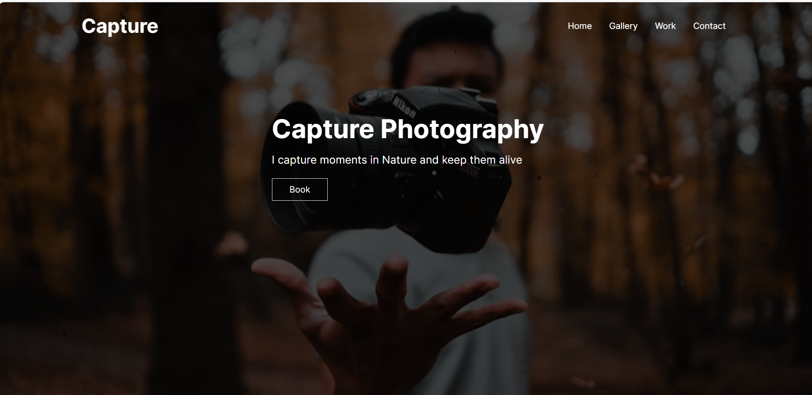
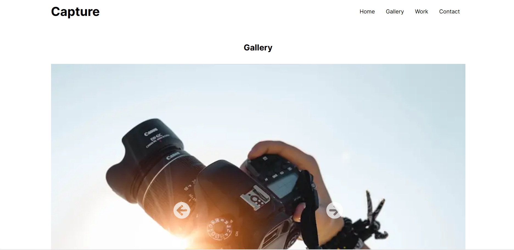

# Getting Started

# Project Overview
Capture Photography is a modern, responsive, and interactive website designed for photographers. Built with Next.js and Tailwind CSS, this website is optimized for SEO and high performance.

# Features
📸 Photo Gallery: Organize and display photographs in a beautifully designed grid.
🖼️ Full-Screen View: Option to view individual images in full-screen mode.
📱 Responsive Design: Works seamlessly on all screen sizes.
🔄 Fast Loading: Optimized for performance and quick loading times.
🌐 SEO-Optimized: SEO-friendly structure with metadata managed by Next.js.

# Tech Stack
Framework: Next.js
Styling: Tailwind CSS
Image Optimization: Next.js Image component

